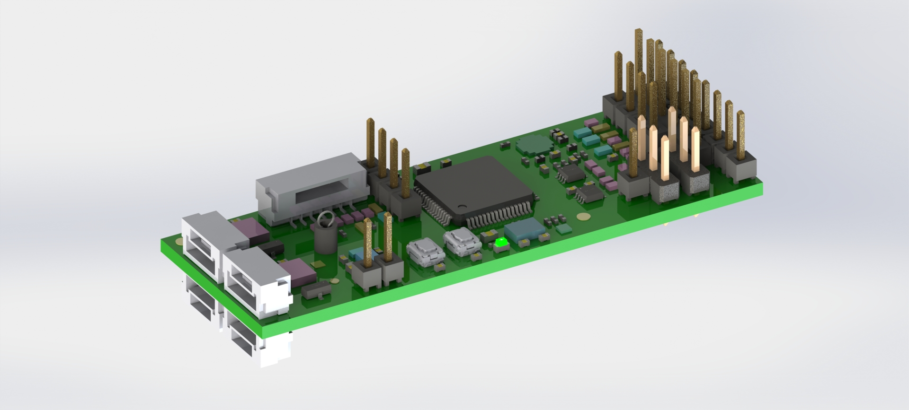
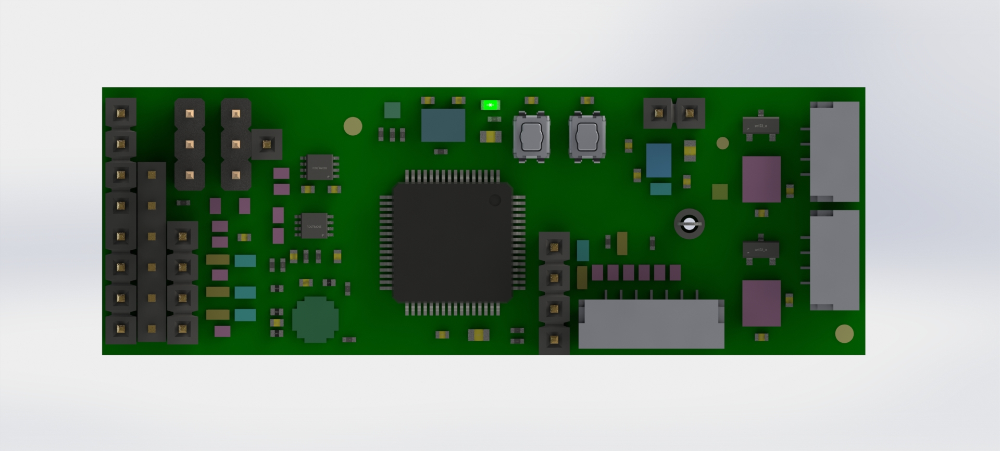
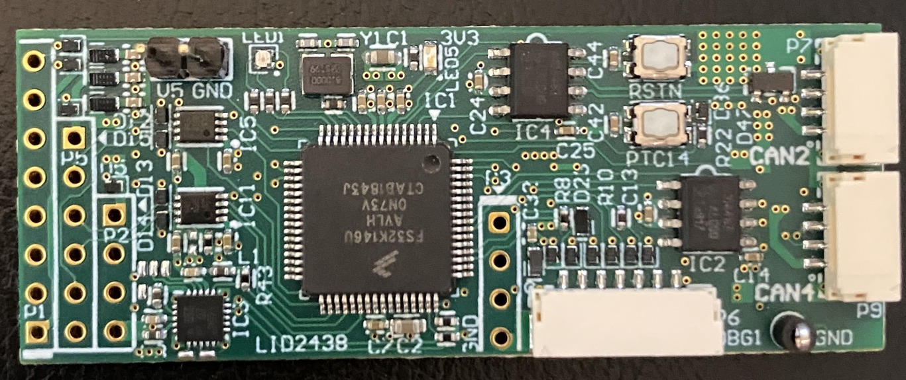

# RDDRONE-UCANS32K146


**This GitBook is still a work in progress!**



See also the [NXP Mobile Robotics Community ](https://community.nxp.com/community/mobilerobotics)for questions and answers about all our mobile robotics reference designs. There is also [thread for questions about UCANS32K146](https://community.nxp.com/thread/534837).



Also have a look at some of the other **NXP GitBooks**:  
- [HoverGames](https://nxp.gitbook.io/hovergames/)  
- [NavQ Companion Computer](https://nxp.gitbook.io/8mmnavq/)  
- [RDDRONE-BMS772 Battery Management System](https://nxp.gitbook.io/rddrone-bms772/)  
- [D2X Reference Design](https://nxp.gitbook.io/d2x/)  
- [NXP Cup](https://nxp.gitbook.io/nxp-cup-hardware-reference-alamak/)


## What is UCANS32K146?

The RDDRONE-UCANS32K146 development board is a \(UAV\)CAN node reference design for drones, rovers and other small \(autonomous\) vehicles. It is designed to act as a bridge between a CAN bus \(with [UAVCAN](https://uavcan.org/)\) and I2C, SPI, UART, GPIO or any other pin function of the [S32K146 MCU](https://www.nxp.com/products/processors-and-microcontrollers/arm-microcontrollers/s32k-automotive-mcus/s32k1-microcontrollers-for-general-purpose:S32K) \(80 MHz ARM Cortex-M4F, ASIL-B compliant\). This allows sensors, actuators and other peripherals to be controlled by other devices on the same CAN bus, such as the [RDDRONE-FMUK66](https://www.nxp.com/design/designs/px4-robotic-drone-fmu-rddrone-fmuk66:RDDRONE-FMUK66) flight management unit reference design.

Some possible use cases are:

1. Output PWM for motor controllers or servos
   * Relieves the FMU of creating RC-PWM signals
   * Can report information about the motors back to the FMU
2. Battery management systems \(see our [BMS772 reference design](https://nxp.gitbook.io/rddrone-bms772/)\)
   * Report power consumption, state of charge, battery health and other faults to the FMU
3. GPS
   * Allows for more than one GPS to be connected to the FMU by communicating GPS info over CAN
4. Sensors
   * Airspeed/pressure sensors can report information to the FMU over CAN
5. Anything else
   * Remote lights, arming switches, and safety switches are other peripherals that can be connected to the board and controlled/communicated to the FMU

## Contribute to this GitBook

We would really like to receive your feedback regarding this GitBook. It is synchronized to a [Git repository on GitHub](https://github.com/NXPHoverGames/GitBook-UCANS32K146), so you can just open an issue. If you want to contribute you can also open a pull request. The pages are written using an extended version of [Markdown](https://www.markdownguide.org/), so it should be pretty straightforward to add sections or even complete pages!

