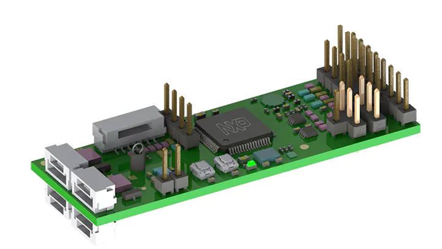

# RDDRONE-UCANS32K146


**This GitBook is still a work in progress!**



See also the [NXP Mobile Robotics Community ](https://community.nxp.com/community/mobilerobotics)for questions and answers about all our mobile robotics reference designs. There is also [thread for questions about UCANS32K146](https://community.nxp.com/thread/534837).



Also have a look at some of the other **NXP GitBooks**:  
- [HoverGames](https://nxp.gitbook.io/hovergames/)  
- [NavQ Companion Computer](https://nxp.gitbook.io/8mmnavq/)  
- [RDDRONE-BMS772 Battery Management System](https://nxp.gitbook.io/rddrone-bms772/)  
- [D2X Reference Design](https://nxp.gitbook.io/d2x/)  
- [NXP Cup](https://nxp.gitbook.io/nxp-cup-hardware-reference-alamak/)


## What is UCANS32K146?

The RDDRONE-UCANS32K146 development board is a \(UAV\)CAN node reference design for drones, rovers and other small \(autonomous\) vehicles. It is designed to act as a bridge between a CAN bus \(with [UAVCAN](https://uavcan.org/)\) and I2C, SPI, UART, GPIO or any other pin function of the [S32K146 MCU](https://www.nxp.com/products/processors-and-microcontrollers/arm-microcontrollers/s32k-automotive-mcus/s32k1-microcontrollers-for-general-purpose:S32K) \(80 MHz ARM Cortex-M4F, ASIL-B compliant\). This allows sensors, actuators and other peripherals to be controlled by other devices on the same CAN bus, such as the [RDDRONE-FMUK66](https://www.nxp.com/design/designs/px4-robotic-drone-fmu-rddrone-fmuk66:RDDRONE-FMUK66) flight management unit reference design.


The relevant part numbers are:

* [KIT-UCANS32K146](https://www.nxp.com/part/KIT-UCANS32K146#/) \(complete development kit with **two** UCANS32K146 boards, a debugger and an adapter board - everything you need to get started!\)
* [UCANS32K146-01](https://www.nxp.com/part/UCANS32K146-01#/)  \(a single UCANS32K146 board, without additional debugger\)


### Use cases

Possible use cases are:

1. PWM output for motor controllers or servos
   * Relieves the FMU of creating RC-PWM signals
   * Can report information about the motors back to the FMU
2. Battery management systems \(also have a look at our [BMS772 reference design](https://nxp.gitbook.io/rddrone-bms772/)!\)
   * Report power consumption, state of charge, battery health and other faults to the FMU
3. GPS
   * Allows for more than one GPS to be connected to the FMU by communicating GPS info over CAN
4. Sensors
   * Airspeed/pressure sensors can report information to the FMU over CAN
5. And many more
   * Remote lights, arming/safety switches, and really any other peripheral which needs to communicate with the FMU can be connected to the UCANS32K146 development board.

### Board specifications

* [NXP S32K146 Automotive MCU](https://www.nxp.com/products/processors-and-microcontrollers/arm-microcontrollers/s32k-automotive-mcus/s32k1-microcontrollers-for-general-purpose:S32K) \(80 MHz ARM Cortex-M4F, ASIL-B compliant\)
* Dual [NXP TJA1044 CAN transceivers](https://www.nxp.com/products/interfaces/can-transceivers/can-with-flexible-data-rate/high-speed-can-transceiver-with-standby-mode-mantis-family:TJA1044) \(with dual [4-pin JST-GH connectors](https://github.com/pixhawk/Pixhawk-Standards/blob/master/DS-009%20Pixhawk%20Connector%20Standard.pdf)\)
* [NXP EdgeLock SE050 secure element](https://www.nxp.com/products/security-and-authentication/authentication/edgelock-se050-plug-trust-secure-element-family-enhanced-iot-security-with-maximum-flexibility:SE050) with NFC interface \(with external antenna, not included\)
* RC-PWM pin header with optional external power input
* Through-hole solder pads \(for 0.100" pin headers\) that expose SPI, I2C and UART. Can also be remapped to other pin functions \(GPIO, ADC, timer, ...\)
* 5-12V power input; the board can be powered from the 4-pin JST-GH CAN connectors or the 2-pin power input header. There is an optional power input for the RC-PWM header as well.

More information is [available on the NXP website](https://www.nxp.com/design/development-boards/automotive-development-platforms/s32k-mcu-platforms/can-fd-development-system-for-drones-rovers-and-mobile-robotics:UCANS32K146#t990).

## Hardware designs and example software

The hardware schematics and board layout for UCANS32K146 [are available on this GitBook](hardware/designs.md) and [on the NXP website](https://www.nxp.com/design/development-boards/automotive-development-platforms/s32k-mcu-platforms/can-fd-development-system-for-drones-rovers-and-mobile-robotics:UCANS32K146#t990). We encourage you to create your own designs based on our UCANS32K146 board! 

We do not only provide hardware designs, there is also plenty of example software available. There are multiple options to use the UAVCAN protocol. We have also worked with the Apache NuttX and PX4 Autopilot communities to enable their open source software projects on the UCANS32K146. 

Additional designs and example software might be made available in the future.

## Contribute to this GitBook

We would really like to receive your feedback regarding this GitBook. It is synchronized to a [Git repository on GitHub](https://github.com/NXPHoverGames/GitBook-UCANS32K146), so you can just open an issue. If you want to contribute you can also open a pull request. The pages are written using an extended version of [Markdown](https://www.markdownguide.org/), so it should be pretty straightforward to add sections or even complete pages!

