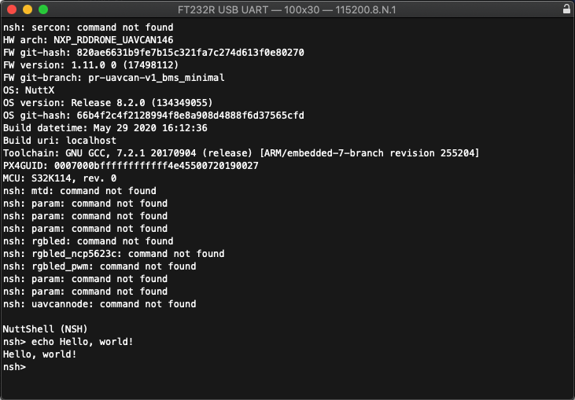

# Available software

## [PX4 Autopilot](http://PX4.io)

UCANS32K146 is a build target for PX4 Autopilot. PX4 is an open source flight control software for drones and other unmanned vehicles. While UCANS32K146 is not a flight controller, it can leverage the PX4 infrastructure to provide communications and portability of peripheral drivers, leading to enablement of a distributed vehicle architecture. For example drivers for secure element SE050 would be identical on the FMU and CAN nodes. PX4 makes use of a managed and maintained version of NuttX RTOS.

[More information](px4-autopilot/about-px4-autopilot.md)

## [Apache NuttX](https://nuttx.apache.org)

In addition to PX4, UCANS32K146 is also a build target in Apache NuttX and can therefore be used without PX4 infrastructure if not needed.

[More information](apache-nuttx/about-apache-nuttx.md)

## [UAVCAN V1](https://uavcan.org/)

UAVCAN is a lightweight protocol designed for reliable intravehicular communication in aerospace and robotic applications over CAN bus, ethernet, and other robust transports. The name UAVCAN stands for Uncomplicated Application-level Vehicular Communication And Networking. It is created to address the challenge of deterministic on-board data exchange between systems and components of next-generation intelligent vehicles: manned and unmanned aircraft, spacecraft, robots, and cars.

[Bare metal example with libuavcan](s32k1-sdk/sdk-example-with-libuavcan.md)

## [SocketCAN API](https://www.kernel.org/doc/Documentation/networking/can.txt)

CAN driver compatible with SocketCAN API, takes benefit of POSIX socket API for painless and portable CAN application development.

[More information](apache-nuttx/socketcan.md)

## [SLCAN - CAN over serial](https://python-can.readthedocs.io/en/master/interfaces/slcan.html)

This software interface supports debugging UAVCAN and CAN on PC reusing an UCANS32K board reprogrammed as a debugger.

[More information](apache-nuttx/slcan.md)

