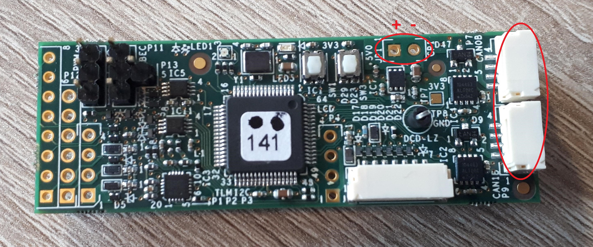
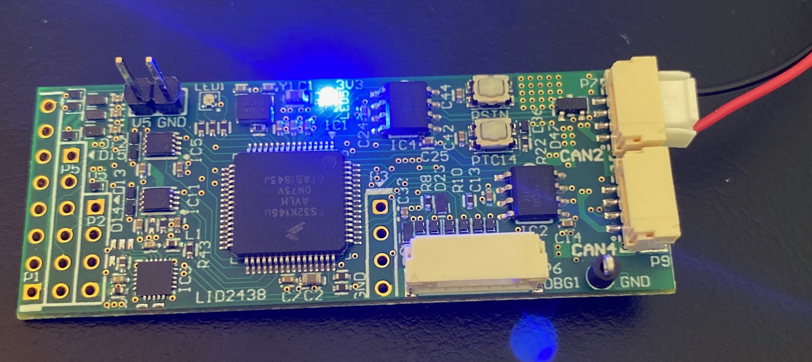
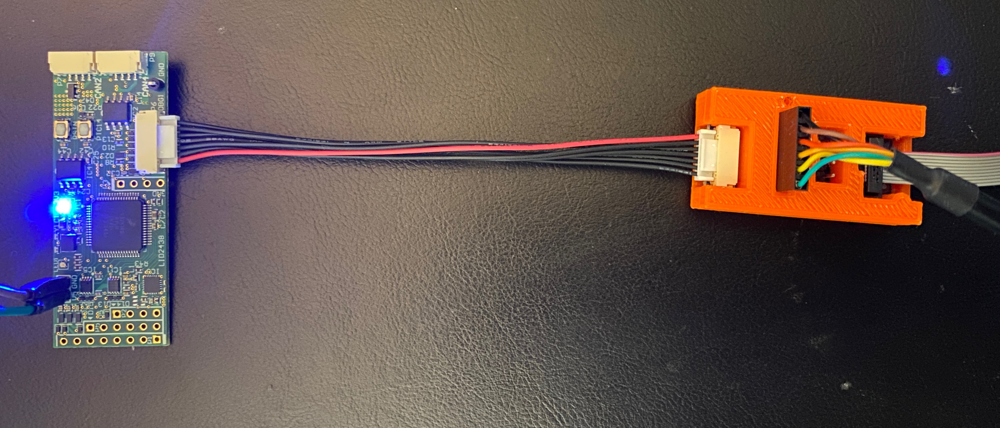

# Getting started

## UCANS32K146 overview

## Powering the board

There are two options when powering the UCANS32K146. The first option is to connect 5V power to the power pins on the board. The second option is to power the board through one of the JST-GH CAN connectors. The middle two pins on the CAN connector are for CAN data, and the outer two are for power. The left-most pin is for 5V, and the right-most pin is for GND.

## Flashing and debugging

For flashing firmware and interfacing with the serial console, a 7-pin JST-GH connector with SWD and UART interfaces is present on the board. It is located on the side of the board next to the CAN connectors.&#x20;

Guides for flashing binaries to UCANS32K146 are available for [PX4 Autopilot](px4-autopilot/building-and-flashing-px4.md#flashing-px4-autopilot-to-the-ucans-32-k146-board) and Apache NuttX.
