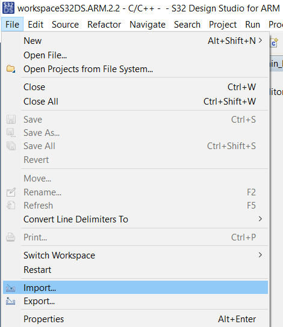
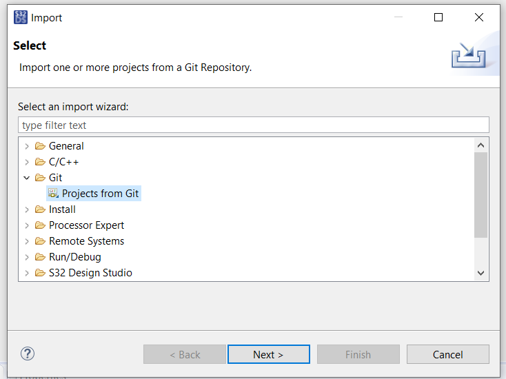
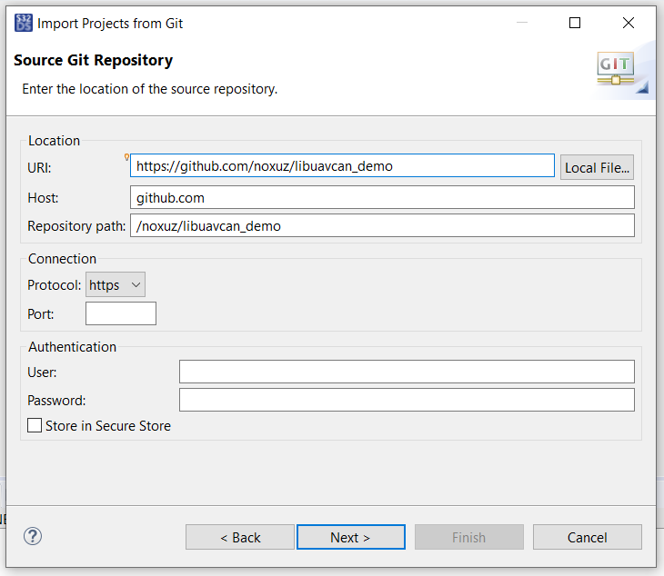

# UAVCAN quick start demo

## S32 Design Studio for ARM

Download and install S32 Design Studio for ARM. It's available for Windows and Linux.



## UCANS32K146 hardware setup

* Interconnect two UCANS32K146 boards with a single 4-wire JST-GH CAN cable between both CAN2 connectors, and CAN bus terminators in the CAN1 connectors below.
* Connect a 5V supply to the pin headers.


This pictures was taken with an earlier version of the UCANS32K146 board, there might be some (minor) differences in board layout. The software settings should be the same, though.


## S32 Design Studio example project

1\. In S32 Design Studio, go to "File" and then "Import...":

2\. Select "Projects from Git" and click "Next":

3\. Paste the Git URL ([https://github.com/noxuz/libuavcan\_demo](https://github.com/noxuz/libuavcan\_demo)) of the demo and click "Next":

4\. Select the master branch and click "Next".

5\. Click "Browse", select the desired destination directory for the project and click "Next".

6\. Choose "Import existing Eclipse projects", click "Next" and then "Finish".

7\. Click the small arrow at the right of the build icon (the hammer) in the toolbar and select NODE\_A to build the code for the first board (transmitter).

8\. Click the yellow lightning shaped icon in the toolbar for flashing the project to the board.

9\. In the list located at the left of the popup window, choose the appropriate profile, e.g. "libuavcanV1\_demo\_Debug NODE\_A" if you are building the code for NODE\_A. Then click "Flash" with the board connected to the J-Link debugger. Don't forget to power the board (5V)!

10\. Repeat steps 7-9 for the other board but with the desired build configuration changed to NODE\_B.

11\. A green led close to the 5V headers should blink approximately once a second. Also see the description at the top of the `src/main.cpp` file. If the green LED from both boards is not blinking, try pressing the reset button on the board that got the NODE\_A program flashed into, which is the one that starts the transmission.

With an oscilloscope or logic analyzer you can view the frames being transmitted at 4Mbit/s data phase speed and at 1Mbit/s in nominal phase:

