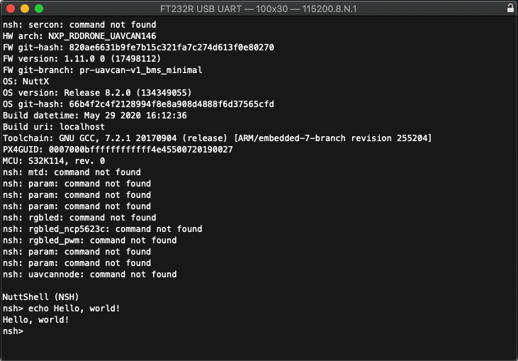

# Supported software overview

## [PX4 Autopilot](http://PX4.io)

UCANS32K146 board is a build target for PX4.io. PX4 is an open source flight control software for drones and other unmanned vehicles. While UCANS32K146 is not a flight controller, it can leverage the PX4 infrastructure to provide communications and portability of peripheral drivers, leading to enablement of a distributed vehicle architecture. For example drivers for secure element SE050 would be identical on the FMU and CAN nodes. PX4 makes use of a managed and maintained version of NuttX RTOS.

## [Apache NuttX](https://nuttx.apache.org)

In addition to PX4/NuttX, UCANS32K146 is a build target in NuttX proper and can be used without PX4 infrastructure if not needed.

## [UAVCAN V1](https://uavcan.org/)

UAVCAN is an open lightweight protocol designed for reliable intravehicular communication in aerospace and robotic applications over CAN bus, Ethernet, and other robust transports. It is created to address the challenge of deterministic on-board data exchange between systems and components of next-generation intelligent vehicles: manned and unmanned aircraft, spacecraft, robots, and cars.

The name UAVCAN stands for Uncomplicated Application-level Vehicular Communication And Networking.

## [SocketCAN API](https://python-can.readthedocs.io/en/master/interfaces/socketcan.html) 

CAN driver compatible with SocketCAN API, takes benefit of POSIX socket API for painless and portable CAN application development."

## SLCAN - CAN over Serial 

This software interface supports debugging UAVCAN and CAN on PC reusing an UCANS32K board reprogrammed as a debugger.

## OTHERS 

&lt;Please add them with a short note and link to appropriate website. Point to repo if it is something we are providing&gt;

