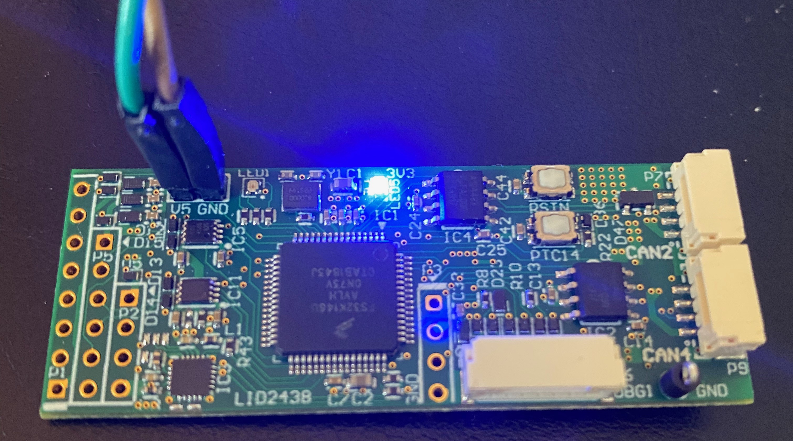
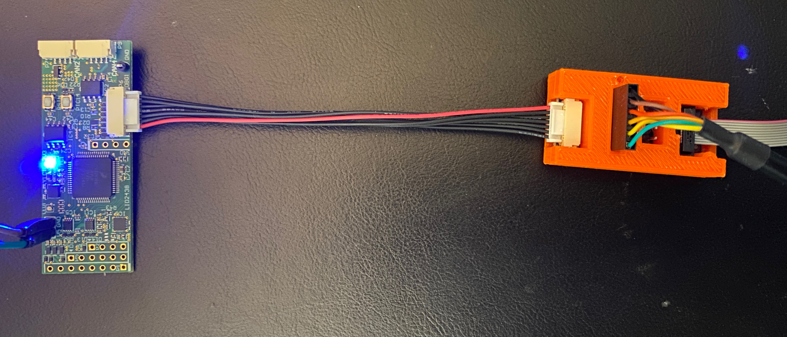

# Getting started

## UCANS32K146 Overview

## Powering the board

There are two options when powering the UCANS32K146. The first option is to connect 5V power to the header pins on the board.


Note: The 5V power header is labeled V5.


The second option is to power the board through one of the JST-GH CAN connectors. The middle two pins on the CAN connector are for CAN data, and the outer two are for power. The left-most pin is for 5V, and the right-most pin is for GND.  
  
_&lt;TODO - add pinout of CAN header here. Copy from schematics&gt;_

## Debugging

For flashing firmware and interfacing with the serial console, a JST-GH J-Link SWD interface is present on the board. It is located on the side of the board next to the CAN connectors. 

A guide for flashing the firmware to the UCANS32K146 is outlined later in this Gitbook.

## Connecting the board to the CAN bus

_**TODO once CAN setup is confirmed by Landon**_

